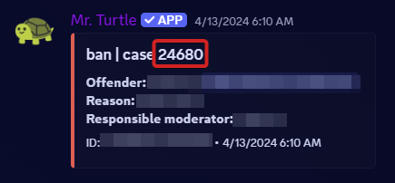

# Mr. Turtle, aka Carl-bot

Carl-bot is our primary moderation bot.

Moderation actions, such as bans, mutes, and warns are all handled through this bot. We also use this bot for server logging. 

| Prefix | Website          |
| ------ | ---------------- |
| `?`    | https://carl.gg/ |

## Commands

### Warn

```md
?warn <user> [reason]
?clearwarn <user> <caseID>
```

- `<user>` can be a mention or user ID.
- Reason is optional but should always be provided.
- The `?clearwarn` command is used to remove a specific warning from a user but it removes all past warnings if no case ID is specified.
- Please note that the case ID is different than the message ID. See below for what the case ID is.
  - 

### Mute and Unmute

```md
?mute <user> [duration] [reason]
?unmute <user> [reason]
```

- `<user>` can be a mention or user ID.
- Duration must be added and is in the format of `2d`, `1h`, `10m`, etc.
- Reason is optional but should always be provided.
- Not specifying the duration mutes the user indefinitely but if the duration is specified then the user is automatically unmuted after the time is up.

### Kick and Tempban

```md
?kick <user> [reason]
?tempban <user> [duration] [reason]
```

- `<user>` can be a mention or user ID.
- Duration must be added and is in the format of `1y`, `20d`, etc.
- Reason is optional but should always be provided.

### Ban and Unban

```md
?ban <user> [reason]
?unban <user> [reason]
```

- `<user>` can be a mention or user ID.
- Reason is optional but should always be provided.
- Adding `1` after `<user>` deletes the user's messages for the past day but other values can also be specified like `1h`
- If no value is specified next to the number then it automatically defaults to `d` 
- Note that we can not purge the user's messages which are older than 7 days. 
- The reason for unbanning a user needs to be the link of their Modmail thread which can be obtained by using `!loglink` in that thread.

### Reason

`?reason <caseID> [newreason]`

- This command can be used to change a pre-existing reason or add one if you didn't before.
- Please note that the case ID is different than the message ID and can be obtained from https://discord.com/channels/281648235557421056/1109011915402903612

### Modlogs

This command is used to check previous warns, mutes, bans etc for a user.

`?modlogs <user>`

### Lockdown

This command is used to lock a particular channel.

```md
?lockdown
?unlockdown
```

### Newtopic

This command is used to ask people to move on and start a new topic.

`!newtopic`
